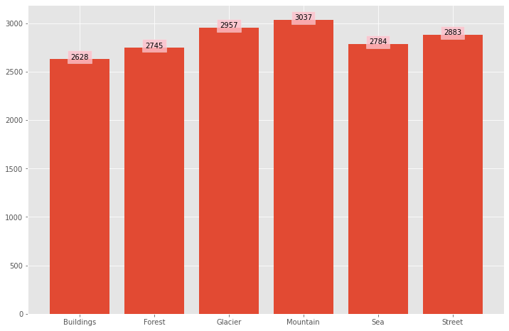

# Intel Image Scene Classification 
## Dataset Distribution

## Sample Images

## Table of Results
<table>
    <tr><th>Model</th><th>Best Hyperparameters</th><th>Buildings Acc</th><th>Forest Acc</th><th>Glaciers Acc</th><th>Mountains Acc</th><th>Sea Acc</th><th>Streets Acc</th><th>Overall Acc</th></tr>
    <tr><td>K Nearest Neighbor</td><td><code>{n_neighbors: 50}</code></td><td>1.71%</td><td>80.69%</td><td>50.25%</td><td>78.58%</td><td>41.11%</td><td>19.24%</td><td><strong>45.96%</strong></td></tr>
    <tr><td>Neural Network</td><td><code>{batch_size: 128, hidden_list: [4096, 4096], learning_rate: 0.0001, epochs: 200}</code></td><td>40.68%</td><td>76.32%</td><td>61.42%</td><td>63.92%</td><td>55.30%</td><td>62.74%</td><td><strong>60.29%</strong></td></tr>
    <tr><td>Convolutional Neural Network</td><td><code>{batch_size:32, learning_rate: 0.00005, epochs: 50}</code></td><td>82.32%</td><td>95.26%</td><td>83.59%</td><td>80.07%</td><td>85.28%</td><td>85.96%</td><td><strong>84.91%</strong></td></tr>
</table>

## Graph of Results

## Author
- Christopher Lim